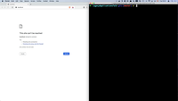
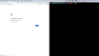
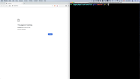
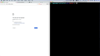

# Containerizing legacy applications

Contains code for all the demonstrations in the *Containerizing legacy applications with dynamic file-based configurations and secrets* talk that I delivered at DevOps Days Toronto 2019 and DevOps Days Boston 2019.

## Pre-requisites

### Install

* [Stern](https://github.com/wercker/stern) for tailing multiple pod logs
* [Helm client](https://helm.sh/docs/using_helm/#installing-the-helm-client)
* [Docker](https://docs.docker.com/install)
* Kubernetes
 * Via [Docker for Mac](https://docs.docker.com/docker-for-mac/kubernetes/) (tested)
 * [Minikube](https://kubernetes.io/docs/setup/minikube)*

_Currently there are default values for the Helm charts that point to the Docker for Mac host to access the local Docker registry from Kubernetes, so you will need to override this as appropriate_

#### Create a local Docker registry

    docker run -d -p 5000:5000 --restart=always --name registry registry:2

#### Docker credentials

	kubectl create secret docker-registry regcred --docker-server=https://index.docker.io/v1/ --docker-username=[username] --docker-password=[password] --docker-email=[email]

#### Initialise Helm

    helm init --history-max 200

## Demo 0, Run MyBB locally

### Run

    ./0_local.sh

### Video


[Demo 0 video on Vimeo](https://vimeo.com/358959423)

### Notes

Coming soon...

## Demo 1, Run MyBB in a single Docker container

Outcome of this demo is to show a basic Docker image build and that MyBB runs on a local Docker host (with some caveats)

    ./1_docker.sh

### Video


[Demo 1 video on Vimeo](https://vimeo.com/357978539)

## Demo 2, Run MyBB in multiple containers using Docker Compose

### Run

    ./2_compose.sh
    
### Video


[Demo 2 video on Vimeo](https://vimeo.com/358958970)

### Notes

    export PATH=$PATH:/Applications/MySQL\ Workbench.app/Contents/MacOS

## Demo 3, Run MyBB in multiple containers using Docker Swarm

### Run

    ./3_swarm.sh
    
### Video



[Demo 3 video on Vimeo](https://vimeo.com/358959390)

### Notes

Coming soon...

## Demo 4, Run MyBB in multiple containers using Kubernetes

### Run

    ./4_k8s.sh
    
### Video



[Demo 4 video on Vimeo](https://vimeo.com/358959402)

### Notes

Coming soon...

## Demo 5, Install MyBB and dependent services using Helm

### Run

    ./5_helm.sh
    
### Video



[Demo 5 video on Vimeo](https://vimeo.com/358959408)

### Notes

Coming soon...

## Demo 6, Run MyBB with Consul and Vault KV

### Run

    ./6_dynamic.sh
    
### Video

https://learn.hashicorp.com/consul/getting-started-k8s/minikube

https://github.com/helm/charts/tree/master/incubator/vault

replicaCount: 1


[Demo 6 video on Vimeo](https://vimeo.com/358961230)

### Notes

Coming soon...

## Demo 7, Run MyBB with Consul ESM and Vault database secrets engine

### Run

    ./7_rotation.sh
    
### Video



[Demo 7 video on Vimeo](https://vimeo.com/358959419)

### Notes

Coming soon...

## Quick command reference

Replace from-file ConfigMap information

````
kubectl create configmap mybb-configmap --from-file configuration/settings.php --from-file \
configuration/config_k8s.php -o yaml --dry-run | kubectl replace -f -
````

Force a pod to destroy

````
kubectl delete pod [name] --grace-period=0 --force
````

List items in memcache

````
echo "stats items" | ncat 127.0.0.1 11211
````
