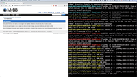

# Containerizing legacy applications

Contains code for all the demonstrations in the *Containerizing legacy applications with dynamic file-based configurations and secrets* talk that I delivered at DevOps Days Toronto 2019 and DevOps Days Boston 2019.

## Pre-requisites

### Install

* [Stern](https://github.com/wercker/stern) for tailing multiple pod logs
* [Helm client](https://helm.sh/docs/using_helm/#installing-the-helm-client)
* [Docker](https://docs.docker.com/install)
* Kubernetes
 * Via [Docker for Mac](https://docs.docker.com/docker-for-mac/kubernetes/) (tested)
 * [Minikube](https://kubernetes.io/docs/setup/minikube)*

_Currently there are default values for the Helm charts that point to the Docker for Mac host to access the local Docker registry from Kubernetes, so you will need to override this as appropriate_

#### Create a local Docker registry

To store the Docker images that are built as part of the demos you will need a [local Docker registry](https://docs.docker.com/registry/deploying/) (which itself runs in Docker)

    docker run -d -p 5000:5000 --restart=always --name registry registry:2

Alternatively you modify the scripts to push/pull from your own Docker Hub account if you so desire.

#### Docker credentials

If you choose to push/pull images from Docker Hub as opposed to a local registry you will need to add your Docker Hub credentials as a secret to Kubernetes. By default **you won't need to do this for the demos**.

	kubectl create secret docker-registry regcred --docker-server=https://index.docker.io/v1/ --docker-username=[username] --docker-password=[password] --docker-email=[email]

#### Initialise Helm

Once you've installed Helm you'll need to [initialize it](https://helm.sh/docs/helm/) on Kubernetes.

    helm init --history-max 200

## Demo 0, Run MyBB locally

Outcome of this demo is to prove that the [MyBB codebase downloaded from mybb.com](https://mybb.com/download/) will run using the [PHP built-in development web server](https://www.php.net/manual/en/features.commandline.webserver.php).

### Run

    ./0_local.sh

### Video


[Demo 0 video on Vimeo](https://vimeo.com/358959423)

### Notes

Coming soon...

## Demo 1, Run MyBB in a single Docker container

Outcome of this demo is to show a basic Docker image build and that MyBB runs on a local Docker host (with some caveats)

    ./1_docker.sh

### Video


[Demo 1 video on Vimeo](https://vimeo.com/357978539)

## Demo 2, Run MyBB in multiple containers using Docker Compose

Outcome of this demo is to run MyBB in multiple containers, a PHP/Apache container and a MySQL container. This is spun up using [Docker Compose](https://docs.docker.com/compose/). This only demonstrates that MyBB can communicate between containers using host networking.

### Run

    ./2_compose.sh
    
### Video


[Demo 2 video on Vimeo](https://vimeo.com/358958970)

### Notes

    export PATH=$PATH:/Applications/MySQL\ Workbench.app/Contents/MacOS

## Demo 3, Run MyBB in multiple containers using Docker Swarm

Outcome of this demo is to run MyBB in multiple containers but with multiple load-balanced PHP/Apache containers and an overlay network. This is spun up using [Docker Swarm](https://docs.docker.com/engine/swarm/).

### Run

    ./3_swarm.sh
    
### Video


[Demo 3 video on Vimeo](https://vimeo.com/358959390)

### Notes

Coming soon...

## Demo 4, Run MyBB in multiple containers using Kubernetes

Outcome of this demo is to run MyBB in multiple containers but to [Kubernetes](https://kubernetes.io/).

### Run

    ./4_k8s.sh
    
### Video



[Demo 4 video on Vimeo](https://vimeo.com/358959402)

### Notes

Coming soon...

## Demo 5, Install MyBB and dependent services using Helm

Outcome of this demo is to deploy MyBB to Kubernetes using [Helm charts](https://helm.sh/docs/chart_template_guide/) for the MyBB/Apache container and community Helm charts for MySQL and additionally Memcache. Helm is used to pass template variables into the ConfigMap used to generate configuration at deployment time.

### Run

    ./5_helm.sh
    
### Video


[Demo 5 video on Vimeo](https://vimeo.com/358959408)

### Notes

Coming soon...

## Demo 6, Run MyBB with Consul and Vault KV

Outcome of this demo is to deploy MyBB to Kubernetes as above alongside [Consul](https://helm.sh/docs/chart_template_guide/) and [Vault](https://www.vaultproject.io) installed using community Helm charts. This involves using [Consul Template](https://learn.hashicorp.com/consul/developer-configuration/consul-template) to dynamically generate configuration.

### Run

    ./6_dynamic.sh
    
### Video

https://learn.hashicorp.com/consul/getting-started-k8s/minikube

https://github.com/helm/charts/tree/master/incubator/vault

replicaCount: 1


[Demo 6 video on Vimeo](https://vimeo.com/358961230)

### Notes

Coming soon...

## Demo 7, Run MyBB with Consul ESM and Vault database secrets engine

Outcome of this demo is to deploy MyBB to Kubernetes with Consul and Vault as above but using [Consul ESM](https://www.hashicorp.com/blog/consul-and-external-services) to register external services like MySQL and Memcache, and using the [database secrets engine](https://www.vaultproject.io/docs/secrets/databases/index.html) to automatically rotate MySQL credentials.

### Run

    ./7_rotation.sh
    
### Video


[Demo 7 video on Vimeo](https://vimeo.com/358959419)

### Notes

Coming soon...

## Quick command reference

Replace from-file ConfigMap information

````
kubectl create configmap mybb-configmap --from-file configuration/settings.php --from-file \
configuration/config_k8s.php -o yaml --dry-run | kubectl replace -f -
````

Force a pod to destroy

````
kubectl delete pod [name] --grace-period=0 --force
````

List items in memcache

````
echo "stats items" | ncat 127.0.0.1 11211
````
